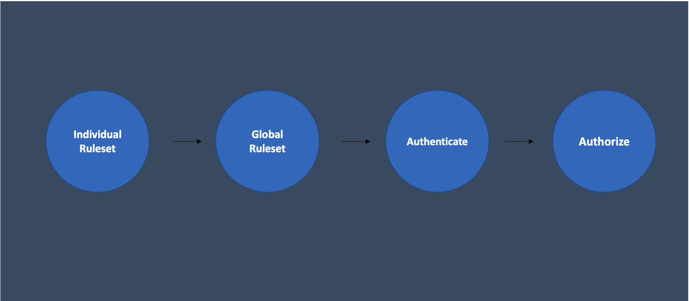
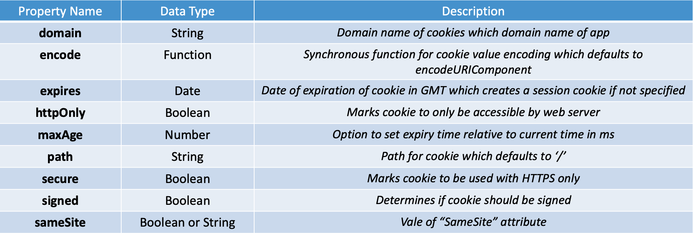

# Welcome to **hopLiteJS**!


hopLiteJS was created in 2021 with the vision to be a developer friendly lightweight middleware library for Node.js. hopLiteJS can be imported and used in any Express-based web application. It has multiple developer interfaces for customizing authentication and authorization. With hopLiteJS, developers no longer have to dread authentication, authorization and hashing. 

In ancient history, the hoplites were some of the fiercest warriors that the world had ever seen. They proved their impeccable reputation by fighting in the harshest of battles, even when they were greatly outnumbered. At the heart of their fortitude was their mission to protect what they deemed to be important. Today as developers, we often find ourselves also outnumbered in a battle for cybersecurity with online hackers. As such, we at hopeLiteJS find our mission to protect our users, as their security is what is important to us.


  ## Table of Contents 
  * [Welcome to **hopLiteJS**!](#welcome-to-hoplitejs-)
  * [Installation Guide](#installation-guide)
  * [Getting Started](#getting-started)
  * [Data Flow](#data-flow)
  * [Individual Ruleset: Cookies](#individual-ruleset--cookies)
  * [Cookie](#cookie-)
  * [Individual Ruleset: Cookie-JWTs](#individual-ruleset---cookie-jwts)
  * [Global ruleset](#global-ruleset-)
  * [Authentication](#authentication-)
  * [Authorization](#authorization-)
  * [Hashing](#hashing-)

## Installation Guide
In the terminal type the following command :
```
npm install hopLiteJS
```

## Getting Started

1. Import DefaultHopLite using the following code
2. Import Authenticate and Authorize
3. Import HopLiteSchemas
4. Import Rulesets

```js
const { DefaultHoplite }  = require('hoplitejs');
const { authenticate, authorize} = DefaultHoplite;
const { HopliteSchemas } = require('hoplitejs');
const {createUser, createRulesetCookie, createRuleset,createRulesetCookieJWT} = HopliteSchemas;
const { pwArgon2, hashed, compareArgon2, compared } = HashMethods;
```

## Data Flow

To utilize hopLiteJS, the developer will need to use the Individual Ruleset, Global Ruleset, Authentication and then Authorization. If the developer wishes to use hopLiteJS's bcrypt and argon2 methods, those methods are available as well, although they are not a part of the data flow.



## Individual Ruleset: Cookies

Usage:
```js
const cookieRuleset = hoplite.createRulesetCookie(cookies [, cookieOptions]);
```

The developer is able to add custom cookies by first utilizing the createRulesetCookie method in order to create a cookieRuleset. This method can be used alongside any other ruleset-creating methods in hopLiteJS (eg. createRulesetCookieJWT).

The parameters of the method are cookies (object) and cookieOptions (object) which is optional. The developer is required to first create the data for these parameters. Each key-value pair in the cookies object are individual cookies where the keys are cookie names and values are cookie data. Each key-value pair in the cookie options object consists of security measures to choose from such as domain, encode, etc. (shown below). If there is no cookie option argument set by the developer the cookie option argument will be changed into defaultOptions shown below. The developer is able to input as many cookies as they want.




### Default Cookie Option:
```js
const defaultOptions = {
  httpOnly: true,
  // secure: true, //with this option, you will not see it in Postman. Keep this in mind.
  maxAge: 1209600000,
  sameSite: "lax"
};
```

### Example Code:
Create an object to store cookie options:
```js
const cookieOptions = {
  secure: true,
  httponly: true,
  signed: true,
  expires: new Date(Date.now() + 900000),
  domain: 'hopliteJS.com',
  path: '/hopliteJS'
};
```
### Example Code:
Create an object to store cookie name and value:
```js
const cookies = {
  cookieName1: 'cookie value 1',
  cookieName2: 'cookie value 2',
  foo: 'bar'
};
```

Invoke createRulesetCookie with cookie object and optional cookie option object:
```js
const cookieRuleset = createRulesetCookie(cookies, cookieOptions)
```

## Individual Ruleset: Cookie-JWTs

Usage:
```js
const cookieJWTRuleset = createRulesetCookieJWT(cookieJWTObject)
```
The developer is able to add custom JWTs to cookies by first utilizing the createRulesetCookieJWT method. This method can be used alongside any other ruleset-creating methods in hopLiteJS (eg. createRulesetCookie). 
The parameter of this method is cookieJWTObject. The developer is required to first create the data for this parameters. Each key-value pair in the cookies object are individual cookies where the keys are cookie names and values are JWT objects. The key-value pairs in the JWT objects are secret, payload and the optional cookie options object consisting of optional security measures such as domain, encode, etc. (shown below). If the cookie options parameter is not inputted, default options will be applied, shown below. A developer can set as many cookieJWTs as they want within the cookieJWTObject.


### Default Cookie Option:
```js
const defaultOptions = {
  httpOnly: true,
  // secure: true, //with this option, you will not see it in Postman. Keep this in mind.
  maxAge: 1209600000,
  sameSite: "lax"
};
```

### Example Code:

Create a secret string:
```js
const mySecret = 'password123';
```

Create a payload object
```js
const myPayload = {
  id: h3bv3h3hg3g,
  privilege: 'L2'
}
```

Create an optional options object:
```js
const cookieOptions = {
  secure: true,
  httponly: true,
  signed: true,
  expires: new Date(Date.now() + 400000),
  domain: 'hopliteIsAwesome.com',
  path: '/hopliteAwesome'
}
```

Create a JWT:
First Create a JWT object:
```js
const jwtObj = {
  secret: mySecret,
  payload: myPayload,
  options: cookieOptions
};
```
Create a cookie-JWT object:
```js
const cookieJWTObject = {
  token1: jwtObj
};
```

Invoke createRuleset method with cookieJWTObject as an argument:
```js
const cookieJWTRuleset = hoplite.createRulesetCookieJWT(cookieJWTObject);
```

## Global Ruleset:

After the developer has decided which security methods (eg. cookie, cookieJWT, etc.) to use, they must invoke the createRuleset method with each of these creation methods as arguments. The first argument must be a message which will be used as the res.send at the end of the middleware.

Usage : 
```js
createRuleset(message, [, cookieRuleset], [, cookieJWTRuleset]);
```

### Example Code
Create a message which will be used as the res.send message:
```js
const message = 'Cookie and Cookie-JWTs have been set successfully'
```
Invoke createRuleset with appropriate arguments:
```js
const ruleset = createRuleset(message, cookieRuleset, cookieJWTRuleset);
```


## Authentication:
After creating the global ruleset, the developer is able to authenticate their clients by invoking the authentication helper method. The parameters are global ruleset and res which allows the middleware chain to continue. The function will automatically iterate through the ruleset and apply all of the individual ruleset inputs.


### Example Code:
```js
app.post('/authn', async (req, res) => {
  const result = await authenticate(ruleset, res); 
})
```

## Authorization:
After creating the global ruleset and authenticating, the developer is able to authorize their clients by invoking the authorization middleware method. The only parameter is the global ruleset. The function will automatically iterate through the ruleset and apply all of the individual rulesets inputs. On routes the developer can change the ruleset to allow or disallow certain users with cookies and/or cookieJWTs, this can be achieved by changing the globalruleset within the argument of the authorization middleware. If a user does not have authorization to access a route, the response will be sent with a status code of 403 and the message "You do not have access to this resource."

### Example Code:
```js
app.post('/secretPage', authorize(myRuleset1), (req, res) => {
  res.status(200).send("Authorization Successful");
});

app.post('/secretPage', authorize(myRuleset2), (req,res) => {
  res.status(403).send("You do not have access to this resource.");
});
```

## Hashing:

### A. Hashing using bcrypt

```js
const myPassword = 'password123';
const cost = 10;

const hashedPassword = hoplite.bcryptHash(myPassword, cost = 10);
console.log(hashedPassword); //prints hashed string
```

The developer is required to provide inputPassword (string) and cost (number) as parameters. The inputPassword refers to the password input by the client and cost refers to the number of salt rounds in bcrypt. By default the cost is set to 10 rounds. The output of this function is a hashed string.

### B. Comparing input password with hashed string using bcrypt

```js
const inputPassword = 'password123';
const hashedPassword = 'Hashed Database Password';

const samePassword = hoplite.bcryptCompare(inputPassword, hashedPassword);
console.log(samePassword); //prints true or false
```

The developer is required to provide inputPassword (string) and hashedPassword (string) as parameters. The inputPassword refers to the password input by the client and hashedPassword refers to the hashed password that is stored. A developer can store the hashed password in a database and query for it using the id that is associated with it. The output of this function is a boolean.

### C. Hashing using argon2

```js
const inputPassword = 'password123';
const hashedPassword = hoplite.argonHash(inputPassword);
console.log(hashedPassword); //prints hashed string
```

The developer is required to provide inputPassword (string) as a parameter. The inputPassword refers to the password input by the client. The output of this function is a hashed string.

### D. Comparing input password with hashed string using argon2

```js
const inputPassword = 'qwerty123';
const hashedPassword = 'Hashed Database Password';

const samePassword  = hoplite.argonCompare(inputPassword, hashedPassword);
console.log(samePassword); //prints true or false
```

The developer is required to provide inputPassword (string) and hashedPassword (string) as parameters. The inputPassword refers to the password input by the client and hashedPassword refers to the hashed password that is stored. A developer can store the hashed password in a database and query for it using the id that is associated with it. The output of this function is a boolean.


